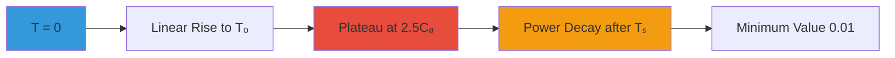

# 🏗️ NSCP 2015 Seismic Parameter Calculator

> Professional web-based tool for structural seismic analysis and design response spectra calculation

[](LICENSE)
[](https://www.asep.org.ph/)
[](https://developer.mozilla.org/en-US/docs/Web/HTML)
[](https://developer.mozilla.org/en-US/docs/Web/JavaScript)
[](https://www.chartjs.org/)

**NSCP 2015 Seismic Parameter Calculator** is a comprehensive web application for calculating seismic design parameters according to the National Structural Code of the Philippines (NSCP) 2015. It features interactive visualizations, real-time calculations, and detailed response spectra generation for structural engineering applications.

*Developed by* **Engr. Lowrence Scott D. Gutierrez** | **XSTRUCTURES**

---


## 🌟 Key Features

### 📊 Comprehensive Seismic Analysis
- **NSCP 2015 Compliant**: Follows Philippine structural code requirements
- **Near Source Factors**: Automatic calculation of Nₐ and Nᵥ with interpolation
- **Seismic Coefficients**: Accurate Cₐ and Cᵥ determination based on soil type and zone
- **Response Spectra**: Complete design response spectra generation with customizable intervals
- **Base Shear Calculation**: Bi-directional (X and Z) base shear analysis with limit checks

### 🎨 Interactive Visualization
- **Dynamic Charts**: Real-time response spectra plotting using Chart.js
- **Structure Period Markers**: Visual indication of Tx and Tz on the spectra curve
- **Reference Lines**: T₀ and Tₛ period markers for design reference
- **Smooth Curves**: Continuous decay curves following NSCP 2015 methodology

### 💻 User-Friendly Interface
- **Modern Design**: Gradient backgrounds with glassmorphism effects
- **Three-Panel Layout**: Organized input, visualization, and results sections
- **Responsive Design**: Fully functional on desktop, tablet, and mobile devices
- **Real-Time Updates**: Instant recalculation on parameter changes
- **Copy Functionality**: One-click table data export for STAAD.Pro or Excel

### 🔧 Advanced Calculations
- **Method A & B Periods**: Empirical and upper limit period calculations
- **Governing Period Selection**: Automatic selection of design periods
- **Multi-Factor Analysis**: Considers seismic zone, soil type, and proximity to faults
- **Limit State Checks**: Upper and lower bound validation for base shear

---

## 📋 Prerequisites

### Required
- **Modern Web Browser**: Chrome 90+, Firefox 88+, Safari 14+, or Edge 90+
- **Internet Connection**: For Chart.js CDN (first load only)

### Recommended
- **Screen Resolution**: 1280x720 or higher for optimal layout
- **JavaScript Enabled**: Required for all calculations

---

## 🚀 Getting Started

### Quick Start

1. **Download the HTML file**
```bash
# Clone repository or download directly
git clone https://github.com/SC0L0W/NSCP-2015-Seismic-Calculator.git
cd NSCP-2015-Seismic-Calculator
```

2. **Open in browser**
```bash
# Simply open the HTML file in any modern browser
# No server or installation required!
```

3. **Start calculating**
   - Enter your project parameters
   - Click "Calculate Parameters" or let it auto-update
   - View results and export data

### Online Access

For convenience, you can also access the calculator through:
- GitHub Pages (if hosted)
- Local file system (file:///)
- Web server (http://localhost)

---

## 💡 Usage Guide

### Input Parameters

#### 1️⃣ Seismic Zone Information

| Parameter | Description | Values |
|-----------|-------------|--------|
| **Seismic Zone Factor (Z)** | Region-specific seismic intensity | Zone 2 (0.2), Zone 4 (0.4) |
| **Seismic Source Type** | Fault classification | Type A, B, or C |
| **Distance to Fault** | Proximity to nearest seismic source | 0-15+ km |

> 💡 **Tip**: Use [HazardHunter Map](https://hazardhunter.georisk.gov.ph/map) to determine your distance to the nearest fault line.

#### 2️⃣ Site Conditions

| Soil Profile | Description | Typical N-SPT |
|--------------|-------------|---------------|
| **SA** | Hard Rock | N/A |
| **SB** | Rock | N/A |
| **SC** | Very Dense Soil | >50 |
| **SD** | Stiff Soil | 15-50 |
| **SE** | Soft Clay | <15 |

#### 3️⃣ Structure Properties

| Parameter | Symbol | Description |
|-----------|--------|-------------|
| **Importance Factor** | I | Building occupancy classification (1.0, 1.25, 1.5) |
| **Response Modification Factor** | R | Structural system ductility factor |
| **Building Frame System** | Ct | Period coefficient (0.0488-0.0853) |
| **Height** | h | Total structure height in meters |
| **Seismic Dead Load** | W | Total dead load + 25% live load (kN) |
| **Period Interval** | Δt | Table generation increment (0.1-1.0 s) |

---

## 📊 Understanding the Results

### Near Source Factors
```
Nₐ = Acceleration factor (1.0-1.5)
Nᵥ = Velocity factor (1.0-2.0)
```
- **Higher values** indicate closer proximity to active faults
- **Interpolated** based on distance for accurate results

### Seismic Coefficients
```
Cₐ = Short period coefficient
Cᵥ = 1-second period coefficient
```
- Determined from NSCP 2015 Tables 208-7 and 208-8
- Modified by near source factors

### Response Spectra Parameters
```
2.5Cₐ = Peak spectral acceleration
T₀ = 0.2 × Tₛ (transition to constant acceleration)
Tₛ = Cᵥ / (2.5Cₐ) (transition to constant velocity)
```

### Base Shear Analysis
```
V = (Z × I × Cₐ × W) / R
```
With limits:
- **Upper Limit**: `(2.5Cₐ × I × W) / R`
- **Lower Limit**: `0.11 × Cₐ × I × W`
- **Period Limit** (T > 0.7s): `(Cᵥ × I × W) / (R × T)`

---

## 📈 Response Spectra Chart

### Chart Features



### Curve Regions

1. **Region 1** (0 → T₀): Linear acceleration increase
2. **Region 2** (T₀ → Tₛ): Constant maximum acceleration (2.5Cₐ)
3. **Region 3** (Tₛ → ∞): Power decay (exponent = 0.8)

### Structure Period Markers

- **Red dots** indicate Tx and Tz values
- **Dashed lines** show T₀ (orange) and Tₛ (dark orange)
- **Hover** over points for exact values

---

## 🔧 Advanced Features

### Copy Table Functionality

Click the 📋 button to copy the response spectra table:

```
Period (s)    Acceleration Sa
0.000         0.440
0.155         1.100
0.776         1.100
1.000         0.855
...
```

**Use cases**:
- Import into STAAD.Pro
- Paste into Excel for further analysis
- Documentation and reporting

### Real-Time Calculations

The calculator automatically updates when you:
- Change any dropdown value
- Modify numeric inputs
- Adjust structure height or weight

**No "Calculate" button click required!**

---

## 📱 Responsive Design

### Desktop (1280px+)
- Three-column layout
- Full chart visualization
- Complete results panel

### Tablet (768px - 1279px)
- Single-column stacked layout
- Full-width sections
- Touch-optimized controls

### Mobile (< 768px)
- Compressed interface
- Larger touch targets
- Scrollable sections

---

## 🎓 Code Structure

### Main Components

```javascript
// Near Source Factor Calculation
interpolateNearSourceFactor(sourceType, distance, factorType)

// Seismic Coefficient Determination
calculateSeismicCoefficient(soilType, Z, Na, Nv, coeffType)

// Spectra Table Generation
generateSpectraTable(Ca, Cv, T0, Ts, interval)

// Main Calculation Engine
calculateParameters()

// Chart Rendering
updateSpectraChart(Ca, Cv, T0, Ts, Tx, Tz)
```

### Data Tables

```javascript
// NSCP 2015 Table 208-4 & 208-5
nearSourceFactors = {
    Na: { A: {...}, B: {...}, C: {...} },
    Nv: { A: {...}, B: {...}, C: {...} }
}

// NSCP 2015 Table 208-7 & 208-8
seismicCoefficients = {
    Ca: { SA: {...}, SB: {...}, SC: {...}, SD: {...}, SE: {...} },
    Cv: { SA: {...}, SB: {...}, SC: {...}, SD: {...}, SE: {...} }
}
```

---

## 🔬 Technical Specifications

### Calculation Methodology

#### Period Calculation
```
Method A: T = Ct × h^0.75
Method B: T = 1.2 × Tₐ (Upper Limit)
Governing: min(Method A, Method B)
```

#### Base Shear Formula
```
V = (Z × I × Ca × W) / R

Subject to:
V_max = min((2.5Ca × I × W) / R, (Cv × I × W) / (R × T))
V_min = 0.11 × Ca × I × W
```

#### Response Spectra
```
Sa(T) = {
    Ca                               : T = 0
    Ca + (2.5Ca - Ca) × (T/T₀)      : 0 < T ≤ T₀
    2.5Ca                            : T₀ < T ≤ Tₛ
    (2.5Ca) × (Tₛ/T)^0.8            : T > Tₛ
}
```

---

## 🛠️ Customization

### Color Scheme

Edit the CSS variables in `<style>`:

```css
/* Primary gradient */
background: linear-gradient(135deg, #667eea 0%, #764ba2 100%);

/* Chart colors */
borderColor: '#3498db',           /* Spectra curve */
backgroundColor: '#e74c3c',       /* Period markers */
```

### Chart Configuration

Modify Chart.js options:

```javascript
options: {
    scales: {
        x: { min: 0, max: 5 },    // Period range
        y: { min: 0 }              // Acceleration range
    }
}
```

### Calculation Precision

Adjust decimal places:

```javascript
.toFixed(3)  // 3 decimal places for most values
.toFixed(2)  // 2 decimal places for forces
```

---

## 📚 References

### NSCP 2015 Code Sections

- **Section 208.4**: Near-Source Factors
- **Section 208.5**: Seismic Coefficients
- **Section 208.5.2**: Design Response Spectra
- **Section 208.5.2.1**: General Procedure
- **Equation 208-12**: Approximate Period Formula
- **Equation 208-14**: Period Upper Limit

### External Resources

- [NSCP 2015 Official](https://www.asep.org.ph/)
- [HazardHunter PH](https://hazardhunter.georisk.gov.ph/map)
- [Chart.js Documentation](https://www.chartjs.org/docs/)
- [Philippine Fault Map](https://www.phivolcs.dost.gov.ph/)

---

## 🐛 Troubleshooting

| Issue | Solution |
|-------|----------|
| **Chart not displaying** | Ensure internet connection for Chart.js CDN |
| **Calculations incorrect** | Verify all input parameters are positive numbers |
| **Copy button not working** | Use a modern browser with clipboard API support |
| **Mobile layout broken** | Clear browser cache and reload |
| **Table not generating** | Check period interval is between 0.1-1.0 |

---

## 🗺️ Roadmap

- [ ] Additional seismic zones (Zone 1, Zone 3)
- [ ] Vertical seismic coefficient calculation
- [ ] Soil liquefaction assessment
- [ ] PDF report generation
- [ ] Multi-language support (Filipino/English)
- [ ] Save/Load project functionality
- [ ] Comparison mode for multiple structures
- [ ] API integration for automated workflows

---

## 🤝 Contributing

Contributions are welcome! Here's how:

1. **Fork** the repository
2. **Create** a feature branch (`git checkout -b feature/NewCalculation`)
3. **Commit** changes (`git commit -m 'Add new calculation method'`)
4. **Push** to branch (`git push origin feature/NewCalculation`)
5. **Open** a Pull Request

### Development Guidelines

- Maintain NSCP 2015 compliance
- Add comments for complex calculations
- Test on multiple browsers
- Update documentation for new features
- Validate all formulas against code

---

## 📄 License

This project is licensed under the MIT License - see the [LICENSE](LICENSE) file for details.

---

## 👤 Author

**Engr. Lowrence Scott D. Gutierrez**

- 🏢 Organization: **XSTRUCTURES**
- 📧 Email: xstructures.lowrence@gmail.com
- 💼 LinkedIn: [@lsdg](https://www.linkedin.com/in/lsdg)
- 🐙 GitHub: [@SC0L0W](https://github.com/SC0L0W)
- 📘 Facebook: [@xstructures](https://www.facebook.com/@xstructures)

---

## ⚠️ Disclaimer

This calculator is provided as a design aid and should be used by qualified professional engineers. Always verify results with manual calculations and refer to the official NSCP 2015 code for authoritative guidance. The developers assume no liability for design decisions made using this tool.

---

## 🙏 Acknowledgments

- **ASEP**: For the NSCP 2015 code standards
- **PHIVOLCS**: For seismic hazard data and mapping
- **Chart.js**: For excellent charting library
- **Structural Engineering Community**: For valuable feedback
- **Open Source Contributors**: For inspiration and best practices

---

## ⭐ Support

If you find this tool useful:

- ⭐ **Star** this repository
- 🔄 **Share** with fellow engineers
- 🐛 **Report bugs** to help improve
- 💡 **Suggest features** for future updates
- 📝 **Contribute** to documentation

---

## 📞 Get Help

Need assistance?

1. **GitHub Issues**: [Report a problem](https://github.com/SC0L0W/NSCP-2015-Seismic-Calculator/issues)
2. **Email Support**: xstructures.lowrence@gmail.com
3. **Facebook Page**: [@xstructures](https://www.facebook.com/@xstructures)
4. **HazardHunter**: [Fault location help](https://hazardhunter.georisk.gov.ph/map)

---

<div align="center">

**Built with ⚡ for Philippine Structural Engineers**

[View Demo](https://sc0l0w.github.io/NSCP-2015-Seismic-Calculator) · [Report Bug](https://github.com/SC0L0W/NSCP-2015-Seismic-Calculator/issues) · [Request Feature](https://github.com/SC0L0W/NSCP-2015-Seismic-Calculator/issues)

*Ensuring safer structures through better design tools*

</div>
